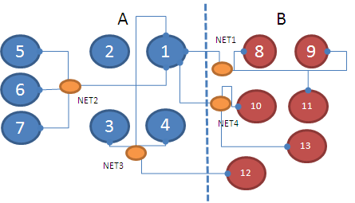

# Fiduccia-Mattheyses Algorithm 

https://img.shields.io/lgtm/grade/python/github/b06901038/Fiduccia-Mattheyses?style=for-the-badge

#### How the different parts of the program interact with one another

- Given a list of Nets $N$, a list of Cells $C$, each $N$ references an `unordered_set` of associated cells $\{(N, c) | \forall c \in C\}$, and each $C$ references an `unordered_set` of nets $\{(C, n | \forall n \in N)\}$. The `unordered_set`'s are then converted to `vector`'s for greater performance.

- A mapping of cell indices to cell names is kept, as well as a mapping of net indices to net names.

- The gains of each $c \in C$ are then initialised. This is done only on the first iteration since cell gains are updated incrementally.

- All $C$'s are stored in a Bucket List $B$ initially and are moved into another Bucket List $B'$ as the loop goes on, until all cells $c \in C$ are transferred from $B$ to $B'$.

- $B, B'$ are of type `Bucket`. A `Bucket` is a `map` to an `unordered_set` of cell ids. Given the old key $k$, the element $v$ and the new key $k'$, we can remove $(k, v)$ and insert $(k', v)$ in $O(1)$. 

- After a cell $c \in C$ is removed from $B$, it is also put into an `unordered_set` $S$ such that we know $c \in S \iff c \in B'$. Procedure $F$ is called on $c$ if balanced criterion is met.

- $F$ finds all neighbouring cells, $c' \in C$, of $c$ connecting to Net $n \in N$, given that $n$ is connected to $c$, updates them in $B$, if $c' \notin S$ or $B'$, if $c' \in S$. **All gains are calculated incrementally.**

- For each cell moved its gain $g_i$, accumulated gain $a_i = \sum_0^i g_i$, maximum partial accumulated gain $ m = \max_i a_i, n = \arg\max a_i$ are calculated. A history $H$ of moved cells are also recorded.

- After moving all cells, we rewind the loop up until $n$. Because F only makes incremental updates, $F$ is safely applied on the cells.

- Terminate the loop if $m \leq 0$. 
  
#### Some other things to know

- A naive initialisation would be to decide which side the cell is on base on the order it is extracted from input. In this case, a more sophisticated approach is used here. $N$ is sorted based on the number of cells it is connected to. $n \in N$ with ascending order is then processed in the following way.
  - if all cells connected to $n$ is not initialised, initialise all of them to a random side $r \in \{0, 1\}$.
  - if the net has more cells on $r$ than $\neg r$, initialise the remaining uninitialised cells to $r$.
  - if the preferred side $r$ has too many cells already, initialise all remaining uninitialised cells to $\neg r$.
  - Empirically, this approaches improves the initial solution by as much as 40%.

- Since a do-first-then-revert approach is used, to minimise the number of cells flipped, $m, n$ are updated if $a_j \geq a_i$ for $j > i$. 

- Due to the aforementioned $m, n$ update rule, it could cause lots of flips with relatively low gain. This causes the program to run much more iterations compared to if it's updated from scratch in every iteration (up to ten-fold iterations), since a larger space is explored. A solution applied here is to terminate early in loops. If $m \leq 1, g_i < 0$, then the loop will terminate early. This approach is found not to compromise the result too much (around 1-2%).

- Assertions are littered all over the place (more than 70 counting `assert` statements alone) to prevent bugs and will (hopefully) be optimised away once `NDEBUG` is defined. Incremental update was initially developed to prevent bugs, as updating gains from scratch every iteration can hide subtle bugs.

- Requires C++11 or later versions to compile.
